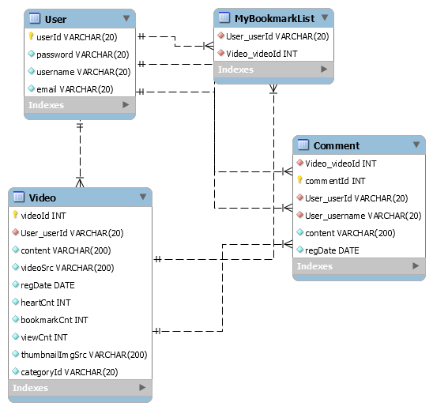
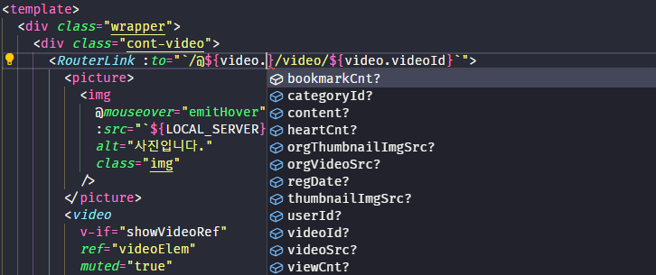
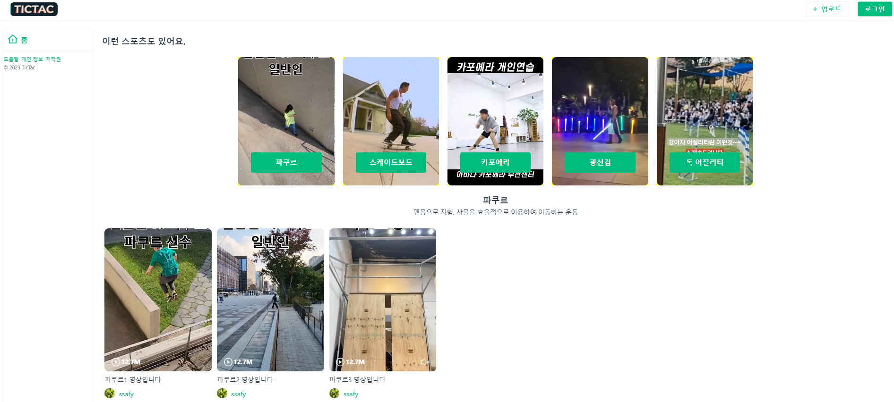
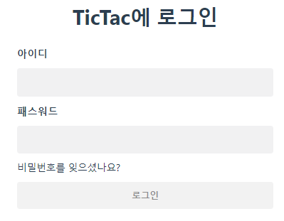
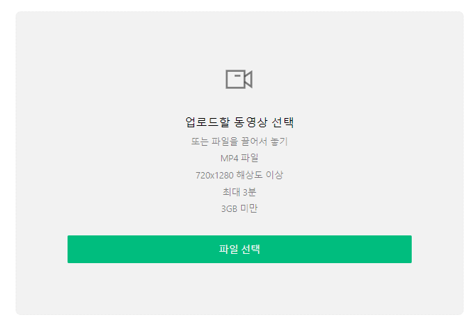
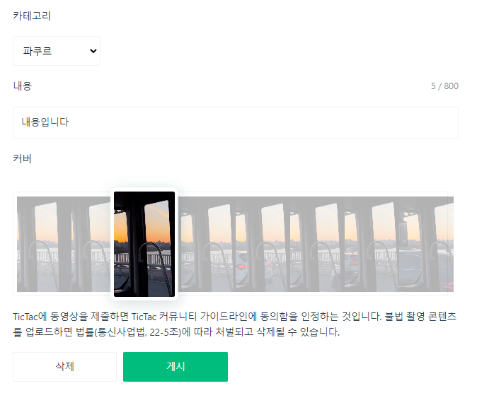
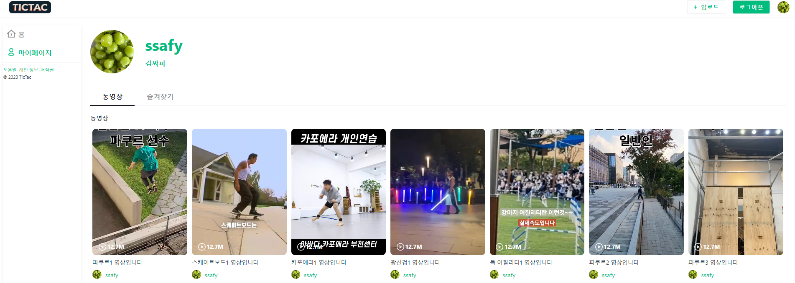

# TicTac!

## 🚀 배포 URL

- 로컬 테스트만 가능합니다.
- 서비스 이용을 위한 예시 테스트 계정
  - ID : ssafy
  - Password : 1234

<br>

# 1. 프로젝트 개요

- 이런 스포츠도 있어요, **TicTac! ✨**

```
마이너 스포츠 영상 플랫폼.
```

<br>

# 2. 팀원 소개

|                                      류기현                                      |                                    황인승                                     |
| :------------------------------------------------------------------------------: | :---------------------------------------------------------------------------: |
|  |  |
|               <a href="https://github.com/geekseal">🔗 GitHub </a>               |           <a href="https://github.com/InSeungHwang">🔗 GitHub </a>            |

<br>

## 류기현

- 프론트엔드 개발 주도
- 페이지 라우팅과 뷰 개발
- 영상 프리뷰 기능을 담은 VideoList 컴포넌트 개발
- 영상 업로드 개발
  - drag & drop
  - 사용자가 선택한 썸네일을 추출해 백엔드 프로젝트 내부에 저장
- SVG 아이콘 컴포넌트화

## 황인승

- 백엔드 개발 주도
- 백엔드 controller, dto, dao 개발
- DB와 연결되도록 mapper 기능 구현
- 유저의 접근성 관리
  - 로그인이 안된 유저의 페이지 접근 제한
- 프론트엔드 전역 상태 관리
  - store의 axios 비동기 통신 코드 개발

<br>

# 3. 기술 스택 및 개발 환경

- 스택
  - 프론트엔드: `Vue` `TypeScript` `pinia` `pure-css` `axios`
  - 백엔드: `Spring Boot` `MySql` `mybatis`
- 개발 환경: `eslint` `prettier`
- 커뮤니케이션: `Discord` `Notion`
- 디자인: `Figma`

<br>

# 4. ERD



🔍 ERD 포인트! foreign key 설정을 통해 테이블 간의 유기적으로 연결했습니다.

<br>

# 5. TicTac 개발 기록

## 5.1. 타입스크립트 도입

- 나은 개발 경험을 위해 **TypeScript**를 도입했습니다.
- 백엔드 DTO와 통일성을 유지함으로써 request body에 필요한 정보를 정확하게 담을 수 있도록 했습니다.

### 5.1.1. `type Video`

```ts
/**
 * Video 타입 정의
 * stores/video.ts
 */
export interface Video {
  videoId?: number;
  userId?: string;
  content?: string;
  videoSrc?: string;
  orgVideoSrc?: string;
  regDate?: Date;
  heartCnt?: number;
  bookmarkCnt?: number;
  viewCnt?: number;
  thumbnailImgSrc?: string;
  orgThumbnailImgSrc?: string;
  categoryId?: string;
}
```

대부분의 서버 통신이 이루어지는 store에 타입을 정의해두었습니다.

```ts
/**
 * 사용 예시
 * component/VideoCard.vue
 */
<script setup lang="ts">
const props = defineProps<{ video: Video }>();
</script>

<template>
  <RouterLink :to="`/@${video.userId}/video/${video.videoId}`">
    <picture>
      
    </picture>
  </RouterLink>
</template>
```

그 결과 아래와 같이 접근 가능한 프로퍼티들이 나열됩니다.


덕분에 프론트 단의 video 객체를 사용할 때 프로퍼티 명을 헷갈리거나 틀리지 않을 수 있었습니다!

<br>

## 5.2. Store의 비동기 통신 Action을 Promise화

컴포넌트에서 Store의 비동기 통신 Action을 사용할 때, axios 통신이 다 끝난 후에 컴포넌트 단의 다음 로직이 동기적으로 실행되길 바랐습니다.

### ▶︎ 해결

async가 붙은 함수가 promise 객체를 반환하도록 하고, await를 사용해서 비동기적 방식을 동기적으로 바꿔주었습니다.

```jsx
// LoginForm.vue

const handleLoginButton = async () => {
  await userStore.login(id.value, password.value);
  router.push({ name: "home" });
};
```

```js
// login.ts

function login(id: string, pw: string) {
    return axios
      .post(`${REST_USER_API}/login`, {
        // ...
```

<br>

## 6. TicTac 세부 명세

- 홈 페이지: 카테고리별 영상 목록 제공



- 로그인 페이지



- 업로드 페이지 (영상 드래그 앤 드롭 전)



- 업로드 페이지 (영상 드래그 앤 드롭 후): 썸네일 선택 가능



- 유저 페이지: 업로드 영상 목록, 즐겨찾기 한 영상 목록 제공



<br>

## 7. TicTac 컨벤션 및 협업 방식

- 하루 2번 notion에서 morning scrum, wrapup scrum을 진행했습니다.

- `eslint`, `prettier` 등을 활용해 일정 수준의 코드 품질을 유지했습니다.

- 각자의 브랜치를 만들어서 github으로 협업했습니다.

<br>
